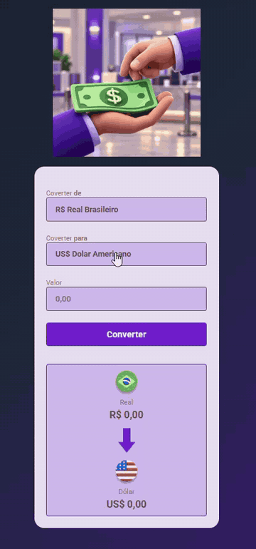

# 💱 Convert Money

Meu primeiro projeto desenvolvido do zero utilizando **HTML, CSS e JavaScript**.

O **Convert Money** é um conversor de moedas criado com o objetivo de colocar em prática os conhecimentos que venho adquirindo durante minha formação como Desenvolvedor Full Stack.

Neste projeto trabalhei desde a estruturação da página e estilização da interface até a implementação da lógica de conversão utilizando JavaScript.

## 🎬 Demonstração do projeto

## 🚀 Tecnologias utilizadas

  
  
  

## 💻 O que coloquei em prática

Durante o desenvolvimento deste projeto, trabalhei conceitos como:

- Estruturação de páginas com HTML
- Estilização e organização da interface com CSS
- Manipulação do DOM com JavaScript
- Eventos de interação com o usuário
- Funções e lógica de programação
- Captura e manipulação de valores
- Conversão e formatação de moedas

## 📚 Sobre o projeto

Este projeto representa mais uma etapa da minha evolução nos estudos de programação.

Foi desenvolvido como parte da minha formação em **Desenvolvimento Full Stack**, sendo também um dos primeiros projetos que estou adicionando ao meu portfólio no GitHub.

Meu objetivo é continuar evoluindo o projeto conforme avanço nos meus conhecimentos e adquiro novas habilidades.

## 👨🏾‍💻 Autor

**Léu Sousa**

Desenvolvedor Full Stack em formação.
